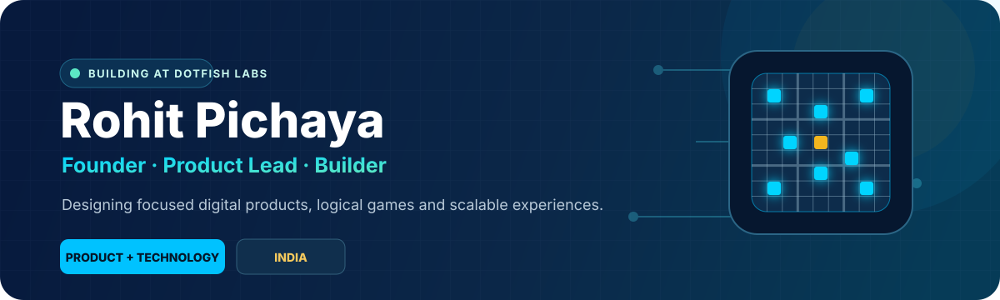
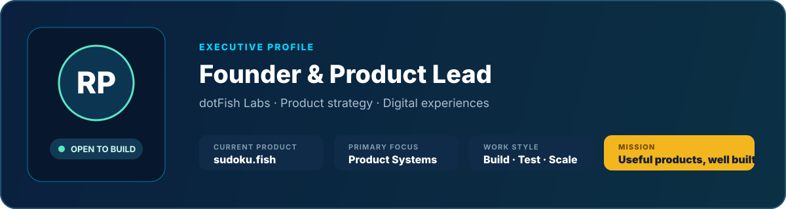

<div align="center">



<br />

<a href="https://sudoku.fish">
  
</a>
<a href="https://github.com/RohitPichaya">
  
</a>


</div>

<br />



## About

I lead **dotFish Labs**, where product thinking, design and technology come together to build focused digital experiences.

My work spans product strategy, business planning, user experience, technical coordination and platform growth. I care about making complex systems feel simple, reliable and useful for real users.

> **Build with clarity. Validate with users. Scale with discipline.**

<br />


## What I Focus On

<table>
  <tr>
    <td width="33%" valign="top">
      <h3>Product Direction</h3>
      Vision, roadmap, feature prioritisation and clear product decisions.
    </td>
    <td width="33%" valign="top">
      <h3>Digital Experience</h3>
      Clean interfaces, usable workflows and consistent experiences across devices.
    </td>
    <td width="33%" valign="top">
      <h3>Platform Growth</h3>
      Reliable architecture, deployment, security, analytics and scalable operations.
    </td>
  </tr>
</table>

## Technology & Operations

<div align="center">


<br /><br />


</div>

## Current Priorities

```text
01  Build sudoku.fish into a trusted modern Sudoku platform
02  Create fast, accessible and distraction-free solving experiences
03  Combine player competition with meaningful learning tools
04  Establish secure, measurable and scalable product operations
```

## GitHub Activity

<div align="center">


</div>

## Contribution Flow

<div align="center">


</div>

## Connect

<div align="center">

<a href="https://sudoku.fish">
  
</a>
<a href="https://github.com/RohitPichaya">
  
</a>

<br /><br />

<b>dotFish Labs</b><br />
<sub>Thoughtful products. Reliable technology. Meaningful experiences.</sub>

</div>
